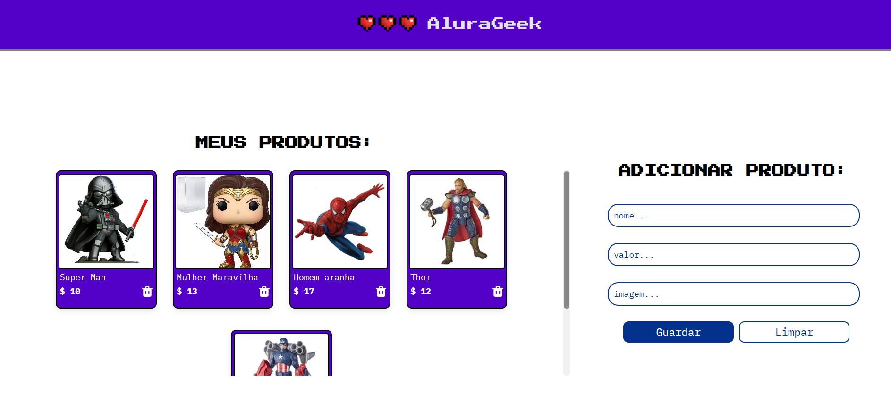

<h1 text-align="center"> E-Commerce Project</h1>

Este projeto é um exemplo de e-commerce simples, onde os produtos são exibidos dinâmicamente com base em uma API falsa. 

## Tecnologias Utilizadas

- **HTML**: Para estruturar a página do e-commerce.
- **CSS**: Para estilizar o layout e os elementos da página.
- **JavaScript**: Para adicionar interatividade e conectar com a API.
- **API Fake**: Para simular a obtenção de dados de produtos.
- **Figma**: Para o design do layout da página.

## Funcionalidades

- Exibição de produtos a partir de dados fornecidos pela API.
- Mensagem de "Sem produtos disponíveis" caso a lista de produtos esteja vazia.
- Responsividade para diferentes tamanhos de tela.

## Demo

## Projeto

[Visite o projeto](https://alura-geek-eta-azure.vercel.app/)
